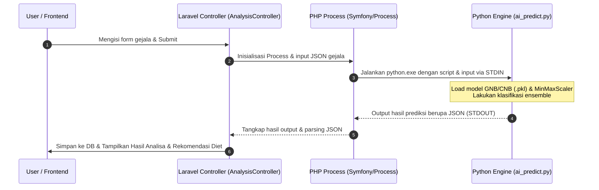

# 🚀 Panduan Setup Project StomaCare di Laptop Baru

> ## 🔄 PEMBARUAN REVISI (2026-07-18) — BACA INI DULU
> Stack & model telah direvisi. Ringkasan otoritatif (menggantikan bagian lama di bawah bila berbeda):
>
> | Komponen | Nilai terkini |
> |---|---|
> | **PHP** | **8.4+** (Laravel 13 mensyaratkan ≥8.4; PHP 8.3 akan gagal `platform_check`). Aktifkan ekstensi `pdo_sqlite` & `sqlite3` di `php.ini`. |
> | **Database** | **SQLite** (`database/database.sqlite`). `.env` → `DB_CONNECTION=sqlite`. (MySQL tidak diperlukan.) |
> | **Python** | Gunakan **virtualenv** `venv/`. Instal: `pip install -r requirements.txt` (numpy, scipy, scikit-learn, pandas, xgboost, joblib, matplotlib). |
> | **`PYTHON_PATH` (.env)** | Path ke `venv/Scripts/python.exe` — **wajib di-quote** bila mengandung spasi, gunakan forward-slash. |
> | **Model AI** | **BernoulliNB tunggal** (`alpha=2.0`, 24 fitur) untuk **4 kelas penyakit lambung**: GERD, Dispepsia, Gastritis, Tukak Lambung. Latih: jalankan `ASLAM_NaiveBayes_FINAL_Revisi.ipynb` (set `EXPORT_FOR_WEBSITE = True`). Uji: `python test_predict.py`. |
> | **Berkas model** | Hanya `model_web/symptom_model.pkl` + `symptom_metadata.json` yang dibaca saat runtime oleh `model_web/ai_predict.py`. |
> | **Input website** | Fitur subjektif: usia, jenis kelamin, tinggi/berat (→IMT), heartburn, regurgitasi, merokok, alkohol, pola makan, kafein/soda, NSAID, aktivitas fisik, kualitas/posisi tidur, waktu makan-tidur, stres, riwayat keluarga, batuk kronis. |
>
> **Menjalankan (mesin dev saat ini):** dari `stomacare/stomacare` →
> `..\..\php84\php.exe artisan migrate:fresh` lalu `..\..\php84\php.exe artisan serve` (http://127.0.0.1:8000).
> Detail model & metodologi: `ASLAM_NaiveBayes_FINAL_Revisi.ipynb`.
> Catatan risiko hilangnya kelas "Normal": `USULAN_PATCH_ai_predict.md`.
>
> *(Bagian di bawah adalah panduan lama — sebagian sudah tidak berlaku, mis. MySQL, PHP 8.3, model GNB/CNB ensemble.)*

---


StomaCare adalah aplikasi berbasis **Laravel (PHP)** yang diintegrasikan dengan **AI Engine (Python)** untuk memprediksi gangguan pencernaan (Dyspepsia, GERD, Gastritis, dan Tukak Lambung) berdasarkan gejala klinis.

Panduan ini akan membantu Anda melakukan instalasi dan konfigurasi dari awal di laptop/perangkat baru agar project dapat berjalan lancar di lingkungan lokal (`localhost`).

---

## 🏗️ Alur Kerja Sistem (Laravel-Python Bridge)
Untuk memahami bagaimana sistem ini bekerja, berikut adalah diagram interaksi antara Laravel dan Python Engine saat melakukan analisis gejala:



---

## 📋 Prasyarat & Software yang Perlu Diinstall

Sebelum memulai setup project, pastikan Anda telah mengunduh dan menginstal software berikut di laptop baru Anda:

### 1. Web Server & PHP Environment (Sangat Direkomendasikan: Laragon)
Karena project sebelumnya dikembangkan di atas **Laragon**, menggunakan Laragon di laptop baru akan sangat mempermudah proses setup database, Apache/Nginx, dan PHP.

*   **Laragon (Full Version)**: [Unduh Laragon](https://laragon.org/download/)
    *   *Kelebihan*: Sudah mencakup PHP, MySQL Server, Apache, Composer, dan Git dalam satu paket portabel.
*   **PHP Version**: **PHP 8.3 atau lebih baru** (Dibutuhkan oleh Laravel `^13.7` yang tertera pada `composer.json`).
*   **Composer**: Dependency Manager untuk PHP (Sudah include di Laragon, atau install manual dari [getcomposer.org](https://getcomposer.org/)).

### 2. Node.js & npm (Frontend Compiler)
Dibutuhkan untuk melakukan *compilation* asset Frontend yang menggunakan **Vite** dan **Tailwind CSS v4**.
*   **Node.js (LTS Version)**: [Unduh Node.js](https://nodejs.org/) (Direkomendasikan versi 18.x atau 20.x ke atas).

### 3. Python (AI Engine)
Dibutuhkan untuk mengeksekusi model kecerdasan buatan (`ai_predict.py`) saat melakukan diagnosis.
*   **Python Version**: **Python 3.10 s.d 3.13** (Versi 3.13 telah terverifikasi).
    *   ⚠️ **PENTING**: Saat menginstal Python di Windows, pastikan untuk mencentang opsi **"Add Python to PATH"** agar perintah `python` dapat dipanggil dari terminal mana saja.

---

## 🛠️ Langkah-Langkah Setup Project (Step-by-Step)

Ikuti langkah-langkah di bawah ini secara berurutan untuk menjalankan project di laptop baru Anda:

### Langkah 1: Pindahkan Folder Project
Pindahkan folder project `stomacare` ke direktori root web server Anda.
*   Jika menggunakan **Laragon**, letakkan di: `C:\laragon\www\stomacare`

---

### Langkah 2: Konfigurasi Environment File (`.env`)
1.  Buka terminal (Command Prompt/PowerShell) di dalam folder project `stomacare`.
2.  Duplikat file `.env.example` menjadi `.env` dengan menjalankan perintah:
    ```bash
    copy .env.example .env
    ```
3.  Buka file `.env` yang baru dibuat dan sesuaikan konfigurasi database Anda jika berbeda:
    ```env
    DB_CONNECTION=mysql
    DB_HOST=127.0.0.1
    DB_PORT=3306
    DB_DATABASE=stomacare
    DB_USERNAME=root
    DB_PASSWORD=
    ```

---

### Langkah 3: Konfigurasi Path Python di `.env` ⚠️ *(Crucial Gotcha!)*
Project ini telah dimodifikasi agar path executable Python dibaca secara dinamis dari `.env` untuk menghindari error hardcoded path di laptop baru.

Di bagian paling bawah file `.env`, sesuaikan nilai `PYTHON_PATH` dengan path Python di laptop baru Anda:

> [!TIP]
> Jika Anda mencentang **"Add Python to PATH"** saat menginstal Python, cukup gunakan nilai default:
> ```env
> PYTHON_PATH=python
> ```
> Namun, jika Apache/Web Server tidak dapat mendeteksinya secara global, masukkan path absolut ke file `python.exe` Anda, misalnya:
> ```env
> PYTHON_PATH=C:\Users\NAMA_USER_BARU\AppData\Local\Programs\Python\Python313\python.exe
> ```

---

### Langkah 4: Install PHP Dependencies (Composer)
Unduh semua library PHP yang dibutuhkan oleh Laravel dengan menjalankan:
```bash
composer install
```

---

### Langkah 5: Generate Application Key
Jalankan perintah ini untuk membuat key enkripsi unik untuk aplikasi Anda:
```bash
php artisan key:generate
```

---

### Langkah 6: Setup Database MySQL
Aplikasi memerlukan database bernama `stomacare`. Anda dapat membuatnya secara otomatis dengan menjalankan skrip pembantu yang sudah disediakan:
```bash
php create_db.php
```
*Atau, Anda bisa membuatnya secara manual melalui phpMyAdmin, Laragon Database GUI (HeidiSQL), atau DBeaver dengan nama database `stomacare`.*

---

### Langkah 7: Jalankan Migrasi Database
Jalankan perintah berikut untuk membuat tabel-tabel database yang diperlukan (seperti users, analyses, dll.):
```bash
php artisan migrate
```

---

### Langkah 8: Install Frontend Dependencies & Compile Assets
Gunakan npm untuk mengunduh library frontend (Vite, TailwindCSS, dll.) dan melakukan build asset:
```bash
npm install
npm run build
```

---

### Langkah 9: Install Python Dependencies (AI Model)
Agar script prediksi AI dapat memuat file model `.pkl` (Pickle), instal pustaka Python yang dibutuhkan menggunakan file `requirements.txt` yang sudah disediakan:
```bash
pip install -r requirements.txt
```
*Pustaka yang diinstal meliputi: `numpy`, `scikit-learn`, `pandas`, dan `xgboost`.*

---

### Langkah 10: Uji Coba Integrasi AI (Python)
Untuk memastikan script Python Anda dapat dijalankan dengan sukses oleh interpreter lokal Anda tanpa error pustaka, jalankan pengujian berikut:
```bash
python test_predict.py
```
> [!NOTE]
> Jika integrasi sukses, terminal akan menampilkan output berupa JSON hasil prediksi seperti:
> `STDOUT: {"status": "success", "prediction": "Normal", "probabilities": {...}}`

---

## 🏃‍♂️ Cara Menjalankan Aplikasi di Lokal

Ada dua cara untuk menjalankan dan mengakses aplikasi Anda di laptop baru:

### Opsi A: Menggunakan Laragon Virtual Host (Sangat Praktis)
1. Buka aplikasi **Laragon** dan klik **"Start All"**.
2. Laragon akan otomatis membuatkan Virtual Host lokal untuk folder Anda.
3. Buka browser Anda dan akses URL: `http://stomacare.test`

### Opsi B: Menggunakan Local Development Server (CLI)
Jika Anda tidak menggunakan Laragon atau ingin menjalankan server secara manual melalui terminal:
1. Jalankan server Laravel:
   ```bash
   php artisan serve
   ```
   *(Aplikasi akan berjalan di `http://127.0.0.1:8000`)*
2. Di jendela terminal terpisah, jalankan compiler Vite (untuk hot-reloads Frontend):
   ```bash
   npm run dev
   ```

---

## 🔍 Troubleshooting (Masalah yang Sering Muncul)

| Masalah | Penyebab | Solusi |
| :--- | :--- | :--- |
| **`AI Analysis Failed: ...`** | Path Python di `.env` tidak valid atau pustaka Python belum lengkap. | 1. Pastikan `PYTHON_PATH` di `.env` mengarah ke file `python.exe` yang benar.<br/>2. Jalankan kembali `pip install -r requirements.txt` untuk memastikan `scikit-learn` dan `numpy` terinstall dengan benar. |
| **`Database "stomacare" not found`** | Database belum dibuat di MySQL lokal. | Jalankan `php create_db.php` atau buat database manual di phpMyAdmin dengan nama `stomacare`. |
| **`Composer / NPM command not found`** | Path instalasi Composer atau Node.js belum masuk ke System Environment Variables. | Restart terminal Anda setelah instalasi selesai, atau tambahkan secara manual ke PATH Windows Anda. |
| **`Vite manifest not found`** | Aset CSS/JS belum di-compile oleh Vite. | Jalankan perintah `npm run build` sekali di folder root project. |

---

Selamat mencoba setup di laptop baru Anda! Jika Anda menemukan kendala atau error tertentu selama proses instalasi, jangan ragu untuk menanyakannya kembali di sini agar kita bisa selesaikan bersama. 😊
